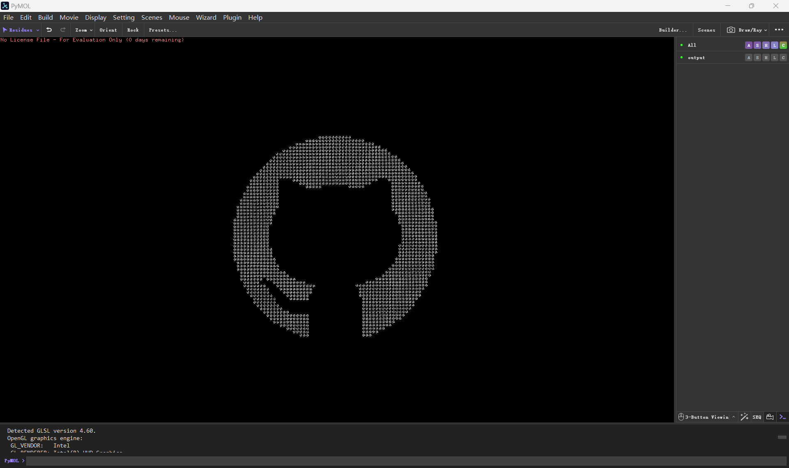
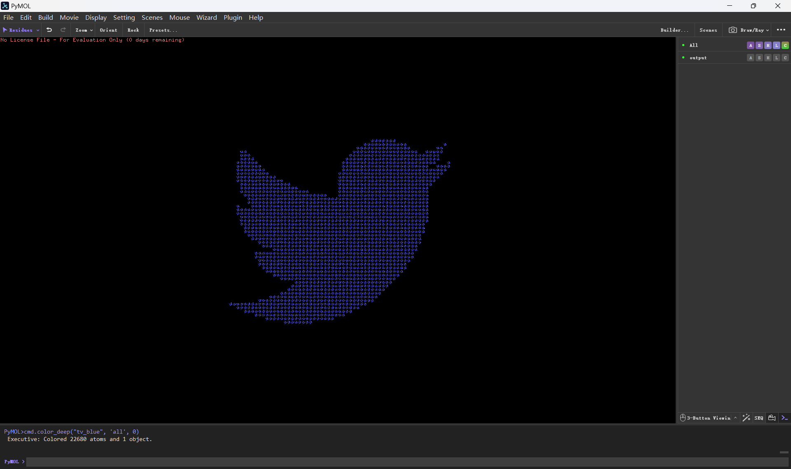
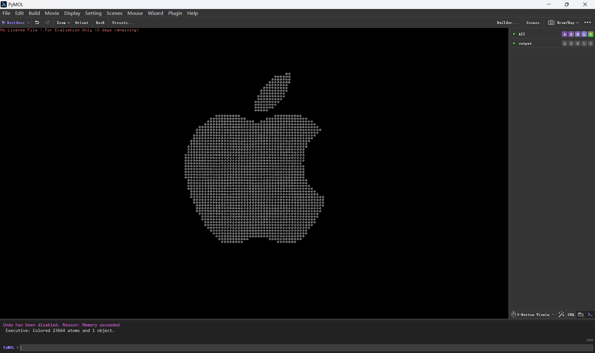
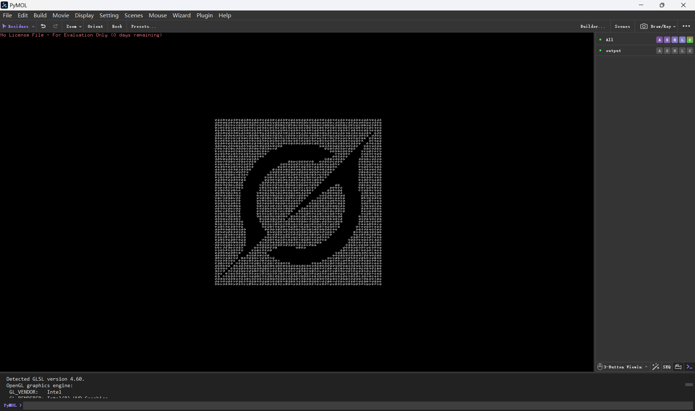

# Chem.mol PixelArt

Powered by [RDKit](https://github.com/rdkit/rdkit) 

## Image to mol

- white area does not display mol

## Demo

### With pymol

|  |  |
|---|---|
|  |  |

## Usage

### pip

```
pip install rdkit pillow numpy
```

### conda

```
conda install -c conda-forge rdkit
```

### Structure

```
├─main.py  
├─input.png  
└─output.mol
```

### Diy

```py
space=4.0 # Intermolecular distance (Å, recommended 3.0-5.0)

img = img.resize((64, 64), Image.NEAREST) # 64x64

template = Chem.MolFromSmiles('C1CCC1') # cyclobutane
```

### Run

```
python main.py
```
